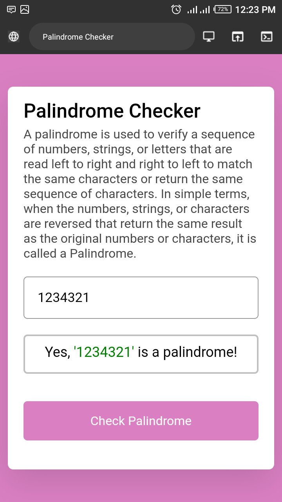

#  Palindrome Checker

A palindrome is used to verify a sequence of numbers, strings, or letters that are read left to right and right to left to match the same characters or return the same sequence of characters. In simple terms, when the numbers, strings, or characters are reversed that return the same result as the original numbers or characters, it is called a Palindrome.

### Requirement 
The Palindrome Return true if the given string is a palindrome. Otherwise, return false.

We'll pass strings with varying formats, such as racecar, RaceCar, and race CAR among others.

We'll also pass strings with special symbols, such as `2A3*3a2, 2A3 3a2, and 2_A3*3#A2.`

###  Tests
- palindrome `("eye")` should return a boolean.
- palindrome `("eye")` should return true.
- palindrome `("_eye")` should return true.
- palindrome `("race car")` should return true.
- palindrome `("not a palindrome")` should return false.
- palindrome `("A man, a plan, a canal. Panama")` should return true.
- palindrome `("never odd or even")` should return true.
- palindrome `("nope")` should return false.
- palindrome `("almostomla")` should return false.
- palindrome `("My age is 0, 0 si ega ym.")` should return true.
- palindrome `("1 eye for of 1 eye.")` should return false.
- palindrome `("0_0 (: /-\ :) 0-0")` should return true.
- palindrome`("five|\_/|four")` should return false.

###  Author Bashir Amir Kano
